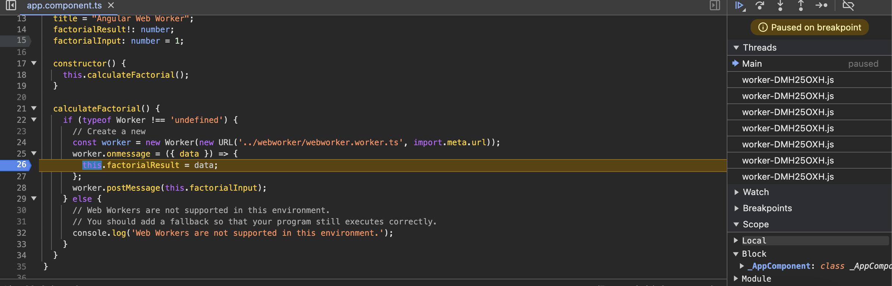
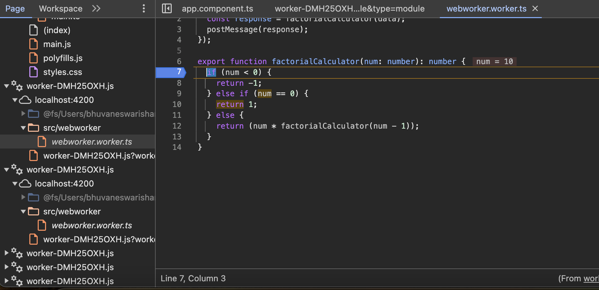

# Angular 18 Project with Web Worker

This project demonstrates how to add web worker capabilities to an Angular 18 application to calculate the factorial of a number. Web workers run scripts in background threads, enabling concurrent processing without affecting the user interface. Note that web workers cannot interact directly with the DOM.

## Prerequisites

- Node.js and npm installed
- Angular CLI installed
- Angular 18 project set up

## Steps to Add Web Worker

### Step 1: Generate Web Worker

Generate a web worker using the Angular CLI. This will create a new worker file in your project's app folder named `webworker` (you can change the name by modifying the parameter in the Angular CLI command).

```bash
ng generate worker webworker
```

### Step 2: Adding other configuration

Move this webworker.ts file to new folder "webworker".

Update the code in webworker.worker.ts , app.component.ts and app.component.html files from this git repository.

### Step 3: Test web worker capabilities.

You can test in debug mode, so run the ng serve command and open Devtools -> source.

There on right side, you can expand Threads, to see webworkers threads are getting generated.



You can even debug the webworkers by selecting the web worker file like below image.

